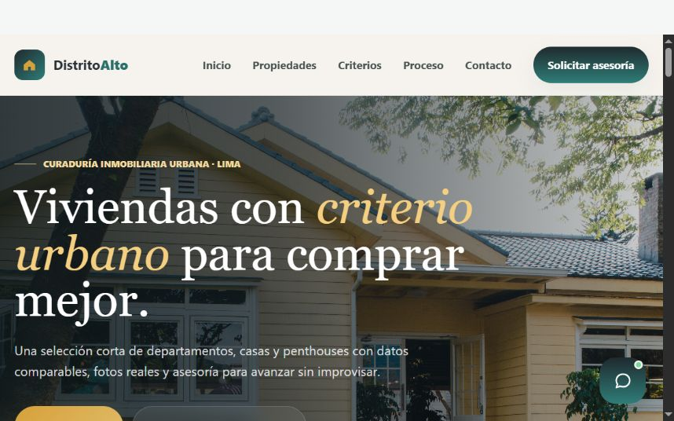

# Distrito Alto



Landing page responsive para una marca inmobiliaria urbana. El proyecto presenta una seleccion corta de propiedades en Lima con filtros, fichas de detalle, formulario de contacto y un chatbot de demostracion orientado a consultas inmobiliarias.

## Funcionalidades

- Hero con imagen real de fondo y mensaje de curaduria inmobiliaria.
- Catalogo filtrable por zona, dormitorios y busqueda libre.
- Fichas de detalle con imagen, precio, area y caracteristicas clave.
- Chatbot frontend de demostracion para consultas sobre propiedades publicadas.
- Recursos visuales locales para que la pagina funcione sin depender de APIs externas.
- Estructura simple, ideal para publicar como sitio estatico en GitHub Pages, Netlify o Vercel.

## Stack

- HTML5
- CSS3
- JavaScript

## Ejecutar localmente

Puedes abrir `index.html` directamente en el navegador. Para probarlo con un servidor local:

```powershell
python -m http.server 3000
```

Luego abre:

```txt
http://127.0.0.1:3000
```

## Estructura

```txt
.
├── index.html
├── styles.css
├── chat.js
└── img/
```

## Alcance

Este repositorio es una demo frontend. No incluye backend, base de datos ni integraciones reales de mensajeria.
